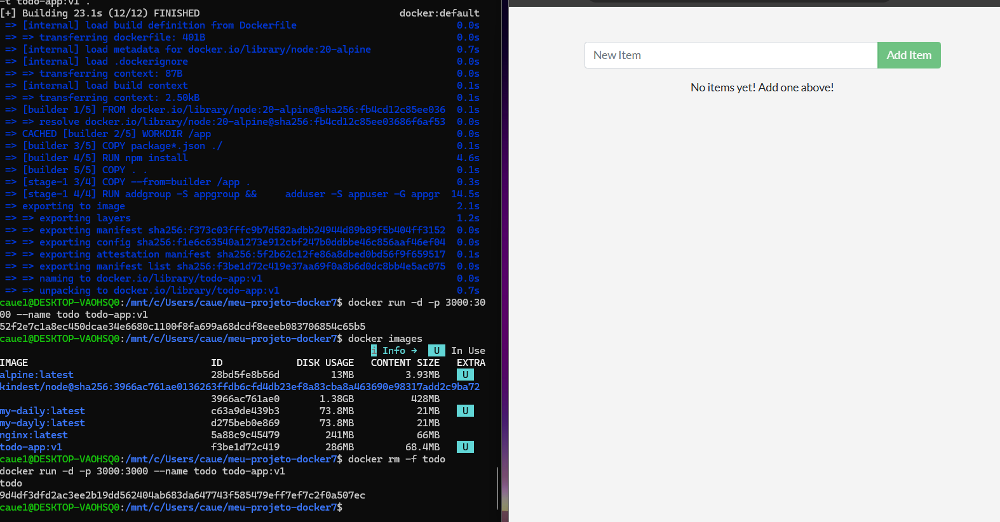
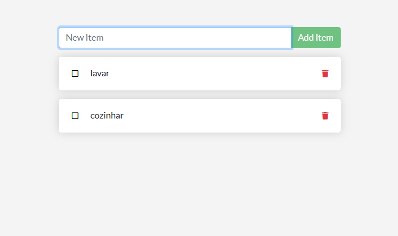
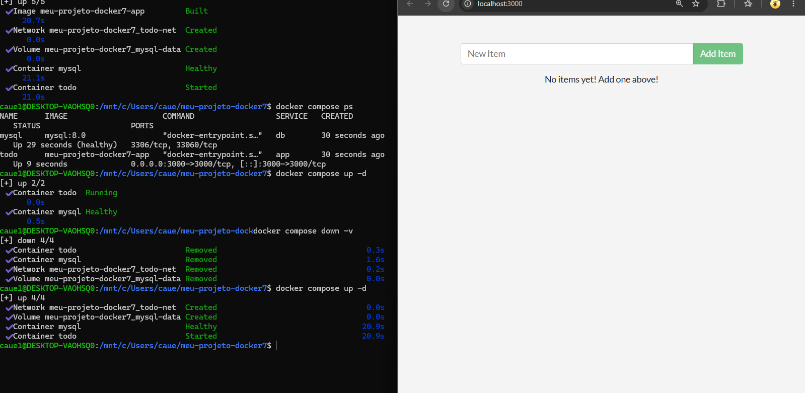
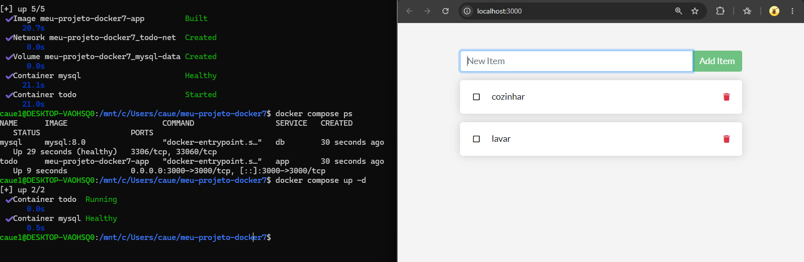
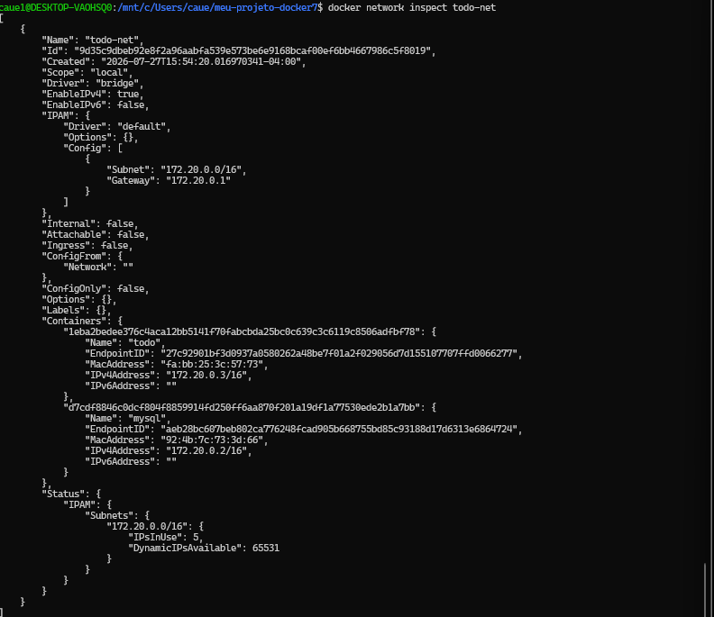
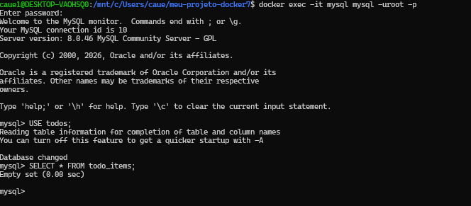
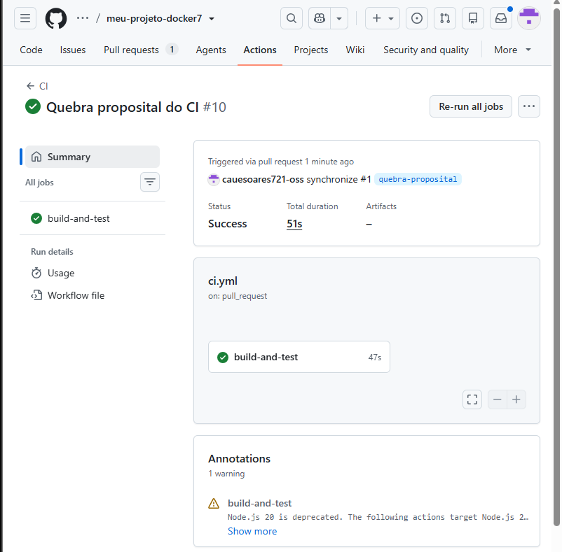
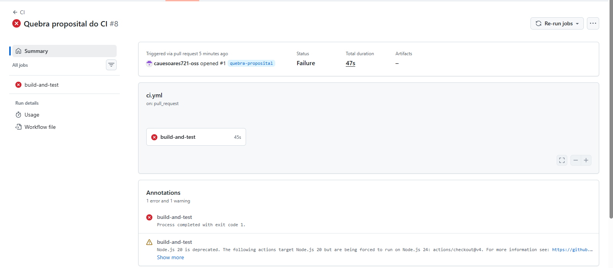

# Atividade Docker + CI — Cauê Soares

> ⚠️ Alguns campos abaixo estão marcados com **[confirmar]** — são pontos que não dá pra confirmar 100% só pelos prints (ex.: conteúdo exato do `.env`, do `ci.yml` ou o `git diff` da quebra proposital). Preencha esses antes de entregar.

**Aluno(a):** Cauê Soares
**Turma:** [turma]
**Data:** 27/07/2026
**Aplicação usada:** docker/getting-started-app — To-Do em Node.js

---

## 1. Como executar este projeto

```bash
git clone https://github.com/cauesoares721-oss/meu-projeto-docker7   # [confirmar URL exata]
cd meu-projeto-docker7
cp .env.example .env
docker compose up -d --build
```

Acesse: **http://localhost:3000**

Para derrubar: `docker compose down` (mantém dados) ou `docker compose down -v` (apaga dados).

---

## 2. Imagem e Dockerfile multi-stage

**Estágios utilizados:** `builder` (instala dependências com `npm install` a partir do `package*.json`) e estágio final, que copia apenas o resultado do build e roda o app enxuto, sem as ferramentas de build.

**Imagem base:** `node:20-alpine`
**Usuário de execução:** `appuser`, criado manualmente no Dockerfile via `addgroup -S appgroup && adduser -S appuser -G appgroup` — **não-root**.
**Tamanho final da imagem:** `todo-app:v1` → 286MB de disco (68,4MB de conteúdo próprio da imagem), conforme `docker images`.

**Por que o multi-stage ajuda?** Ele separa o ambiente de build (com `npm install`, cache e arquivos temporários) do ambiente de execução final, resultando em uma imagem menor, mais rápida de subir e com menos superfície de ataque, já que ferramentas de build não vão para produção.

**Print 1 — build + docker images**


**Print 2 — aplicação rodando com tarefas cadastradas**


---

## 3. Volumes e persistência

**Volume usado:** `mysql-data` (aparece como `meu-projeto-docker7_mysql-data` no `docker compose ps`, prefixo automático do nome do projeto) → montado em `/var/lib/mysql` dentro do container `mysql` **[confirmar caminho exato no seu `docker-compose.yml`]**.

**Print 3 — SEM volume: dados perdidos ao recriar o container**

*(`docker compose down -v` remove o volume; ao subir de novo com `docker compose up -d`, a lista volta vazia — "No items yet!")*

**Print 4 — COM volume: dados preservados**

*(app e banco de pé, containers `todo` e `mysql` saudáveis, itens `cozinhar` e `lavar` continuam na lista)*

**Diferença entre `docker compose down` e `docker compose down -v`:** o primeiro remove containers e rede mas **mantém** o volume (os dados do banco continuam salvos); o segundo remove também o volume, **apagando** os dados do banco.

---

## 4. Rede

**Rede criada:** `todo-net` (bridge, subnet `172.20.0.0/16`)
**Serviços conectados:** `app` (container `todo`, IP `172.20.0.3`) e `db` (container `mysql`, IP `172.20.0.2`)
**A porta do banco está exposta ao host?** Não — no `docker compose ps` a porta do serviço `mysql` aparece apenas como `3306/tcp, 33060/tcp` (sem mapeamento `host:container`), ou seja, o MySQL só é alcançável de dentro da rede `todo-net`; apenas a porta `3000` do app é publicada para o host.

**Por que o app consegue chamar o host `mysql`/`db` sem saber o IP?** Porque o Docker fornece resolução de DNS interna para redes bridge customizadas — cada serviço fica acessível pelo próprio nome (`mysql`), então o app se conecta usando esse nome como hostname, sem precisar saber o IP.

**Print 5 — docker network inspect**


**Print 6 — dados dentro do MySQL (`select * from todo_items;`)**

> ⚠️ **[confirmar]** neste print específico a tabela retornou `Empty set` (consulta feita antes de cadastrar itens pela interface). Vale repetir o `SELECT * FROM todo_items;` depois de adicionar tarefas pela tela, para o print mostrar dados de fato.

---

## 5. Docker Compose

**Serviços:** `app`, `db`
**Rede:** `todo-net` · **Volume:** `mysql-data`
**Healthcheck em:** `db` (mysql) — evidenciado pelo status `Healthy` no `docker compose ps`
**`depends_on` com:** `condition: service_healthy` — o container `todo` só inicia depois que o `mysql` fica `Healthy`
**Variáveis sensíveis:** carregadas via `.env` (não versionado). Modelo em `.env.example`. **[confirmar se o `.env` está de fato no `.gitignore` e o `.env.example` versionado no repositório]**

**Print 7 — docker compose ps**


---

## 6. Integração Contínua (GitHub Actions)

**Arquivo do workflow:** `.github/workflows/ci.yml`
**Gatilhos:** `pull_request` (confirmado pelos dois runs, ambos "Triggered via pull request"). **[confirmar se também está configurado para `push`, como sugere o template]**

**O que o pipeline faz:** **[confirmar contra o `ci.yml` real — os prints mostram só o resumo do job `build-and-test`, não os steps individuais]**
1. [valida o compose]
2. [builda a imagem]
3. [sobe a stack]
4. [aguarda a app responder e testa criar uma tarefa via API]
5. [derruba a stack]

**Print 8 — execução verde ✅**

*(Run #10, branch `quebra-proposital`, status Success, 51s)*

---

## 7. Quebra proposital do CI

**O que eu quebrei:** [descreva a alteração exata que você fez — não aparece nos prints de resumo do Actions]
**Erro que apareceu no log:** o resumo mostra `Process completed with exit code 1` no job `build-and-test` (Run #8). Para citar a mensagem exata, abra o log do step que falhou no Actions e cole aqui.
**Como o CI reagiu:** o job `build-and-test` falhou em 45s (de um total de 47s de execução) — **[confirmar em qual step exatamente]**
**Como eu corrigi:** [o que foi alterado para o job passar a rodar verde no Run #10]

**Link do Pull Request:** `https://github.com/cauesoares721-oss/meu-projeto-docker7/pull/1` **[confirmar — inferido do autor `cauesoares721-oss` e do PR #1 nos prints]**

**Print 9 — execução vermelha ❌ + log do erro**

*(Run #8, branch `quebra-proposital`, status Failure, 47s)*

---

## 8. Dificuldades e aprendizados

[3 a 5 linhas: o que travou, como resolveu, o que ficou mais claro sobre containers depois da atividade — esse trecho é pessoal, escreva com suas palavras]

---

## 9. Checklist de autoavaliação

- [x] Dockerfile multi-stage funcionando *(evidenciado no Print 1)*
- [ ] `.dockerignore` presente *(não aparece nos prints — confirmar)*
- [x] Container não roda como root *(usuário `appuser` criado no build, Print 1)*
- [x] Volume nomeado + persistência demonstrada *(Prints 3 e 4)*
- [x] Rede nomeada + banco não exposto ao host *(Print 5 + Print 7)*
- [x] `compose.yaml` sobe tudo com um comando *(`docker compose up -d`, Prints 4/7)*
- [ ] `.env` no `.gitignore` e `.env.example` versionado *(não aparece nos prints — confirmar)*
- [x] CI verde *(Print 8)*
- [x] PR com CI vermelho documentado *(Print 9 — falta só o link exato do PR)*
- [x] Todos os 9 prints no README *(salvos em `docs/imagens/`)*
